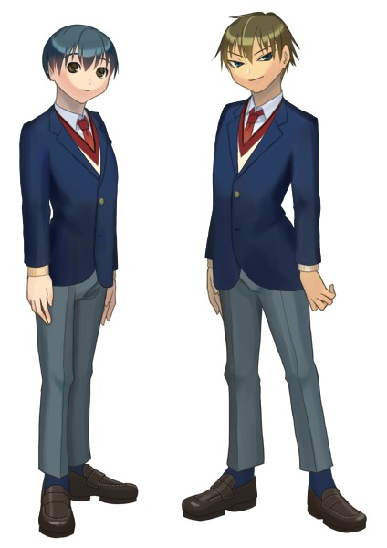
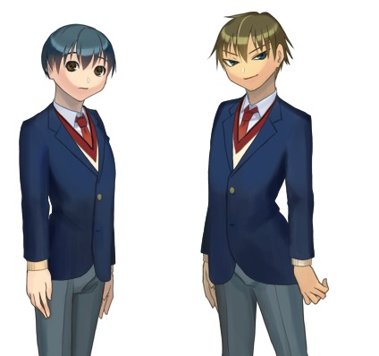
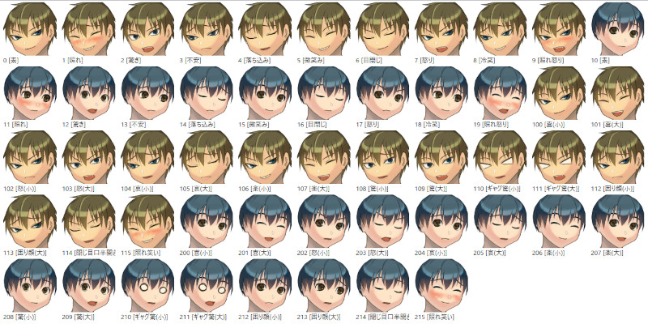

# ダブル男子高校生

## これは何？

伺か用フリーシェル(立ち絵)「ダブル男子高校生」の公開レポジトリです。

男子高校生二人組のフリーシェルで、SSP専用です。
着せ替えと、簡単なオーナードローメニュー素材がついています。

シェルやpsdファイルのダウンロードは
[`Releasesの最新版`](https://github.com/tukinami/double-danshi-KouKousei/releases/latest)からどうぞ。

## ダウンロードできる内容は？

通常は`double-danshi-KouKousei.nar`か`double-danshi-KouKousei-S.nar`、
どちらかをダウンロードしてください。

### double-danshi-KouKousei.nar

フリーシェル本体(全身版)です。縦1200pxです。

### double-danshi-KouKousei-S.nar

フリーシェル本体(膝上版)です。縦796pxです。

### double-danshi-KouKousei_psd.zip

シェル改変のために用意したpsdファイルです。全身、膝上版両方入っています。

## シェル画像のプレビュー

全身版(50%縮小)



膝上版(50%縮小)



表情集




## 着せ替え部位

sakura側、kero側それぞれに以下の着せ替えがあります。

- 靴下(白or紺)(全身版のみ)
- シャツ(半袖or長袖)
- ネクタイ
- セーター(ベストor長袖orなし)
- ジャケット

着せ替えをしない場合は、descript.txtの以下の2行をコメントアウトし、

```
sakura.menu,auto
kero.menu,auto
```

以下の2行を有効にしてくだい

```
// sakura.menuitem0,-
// kero.menuitem0,-
```

## 当たり判定

sakura側、kero側それぞれに当たり判定があります。

- Head
- Shoulder
- Hand

当たり判定上ではマウスカーソルが変わるように設定されています。

## ライセンス

[CC BY 4.0](https://creativecommons.org/licenses/by/4.0/) にて配布いたします。
([日本語版ライセンス](https://creativecommons.org/licenses/by/4.0/deed.ja))

## 連絡先

- [Wavebox](https://wavebox.me/wave/ersk1ec23kr3hrqr/)
- [Mastodon(fedibird)](https://fedibird.com/@tukinami_seika)
- [Mastodon(うかどん)](https://ukadon.shillest.net/@tukinami_seika)
- [公開URL](https://github.com/tukinami/double-danshi-KouKousei)

## 製作者

月波 清火

- [GitHub](https://github.com/tukinami)
- [github.io(これまで公開した制作物)](https://tukinami.github.io)
